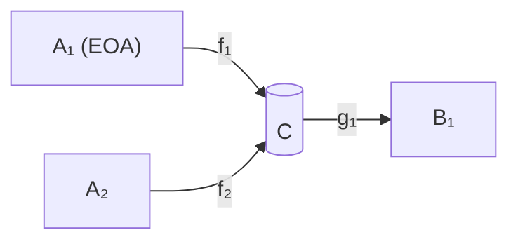

# Modeling Ethereum Smart Contracts and Cross-Chain Logic with Category Theory

---

## I. Introduction

We formalise smart-contract and cross-chain transaction logic using category theory in order to:

1. Represent accounts, contracts, and transactions abstractly and rigorously.
2. Make composability and state-transition structure explicit.
3. Lay categorical foundations for a *world-computer mesh* virtual machine (VM).

---

## II. Objects & Morphisms in the Ethereum Category 𝓔

**Objects**  
• EOAs (Externally-Owned Accounts)  
• CAs (Contract Accounts)

**Morphisms**  
• Transactions / message calls  
• A morphism \(f : A \to B\) is a concrete EVM call from address *A* to *B*.

---

## III. Composition of Morphisms = Smart-Contract Logic

Given

- \(f : A \to C\) (user calls contract *C*)  
- \(g : C \to B\) (contract then calls or transfers to *B*)

we obtain the composite

\[ g \circ f : A \longrightarrow B \]

which models the end-to-end interaction.  A contract’s entire code therefore *presents a sub-monoid* of the hom-set \(\operatorname{Hom}_{\mathcal E}(C,C)\): only certain words in the free monoid of all possible call sequences are permitted.

Nested viewpoint

```
𝓒_C  (internal category)
  objects  : σ₀, σ₁, …   -- abstract states
  morphisms: f_i : σ_j → σ_k -- function executions
   ↓  U        (forgetful functor collapses to)
𝓔    (chain-level category)
  object   : C  -- single contract address
  morphism : tx : C → C or C → B
```

---

## IV. Diagrams as Compositional Views of Contracts

A contract and its surrounding calls assemble into a **diagram** in 𝓔.  Let *D* be the abstract shape; a functor

\[ F : D \longrightarrow \mathcal E \]

instantiates that shape with concrete accounts (nodes) and transactions (arrows).

Example (two EOAs call a contract that pays a third party):



The commutativity or non-commutativity of sub-paths captures logical constraints and potential MEV exploits.

---

## V. Composition & the Contract Object

*Contract object* **C** sits at the centre.  Incoming morphisms, internal endomorphisms, and outgoing morphisms compose subject to rules encoded by the byte-code:

- **Sequencing**: order of calls (strict within EVM execution frame).
- **Branching**: conditional paths correspond to coproducts / pullbacks.
- **Re-entrancy**: non-trivial endomorphisms \(C \to C\) that appear mid-composition.

---

## VI. Toward a Cross-Chain Virtual Machine

1. Form a **bicategory** 𝓑 of blockchains:  
   • Objects: Lₑᵗʰ, Lˢᵒˡ, Lᴸ², …  
   • 1-Morphisms: bridges, relayers  
   • 2-Morphisms: coherence proofs, upgrades.

2. For each chain *L* we have a local category 𝓔_L.  Inclusion functors embed these into 𝓑 via lax functoriality.

3. Atomic cross-chain bundles are represented by **invertible 2-cells** in 𝓑.  Failure of any leg breaks invertibility ⇒ entire bundle reverts.

---

## VII. Next Steps

1. **Contract-as-diagram formalism**: fully specify the syntax and typing rules of 𝓒_C and its forgetful functor to 𝓔.
2. **Internal state transitions**: treat as endomorphisms and verify invariants (e.g., conservation of ERC-20 supply).
3. **Multi-chain extension**: model indexed or fibred categories to manage data/logic living on different chains.
4. **Adjunctions, monads, sheaves**: capture higher-level DeFi patterns (lending ↔ repayment, flash-loan open ↔ close).

---

## VIII. Research Questions

1. Can smart-contract languages be re-expressed as categorical presentations, enabling *correct-by-construction* compilation?  
2. How do categorical structures ensure atomicity and liveness across asynchronous chains?  
3. Can a cross-chain VM be designed as a category of diagrams equipped with compositional constraints and optimisation objectives?  
4. What new alpha emerges when this mesh VM unlocks previously infeasible arbitrage topologies? 